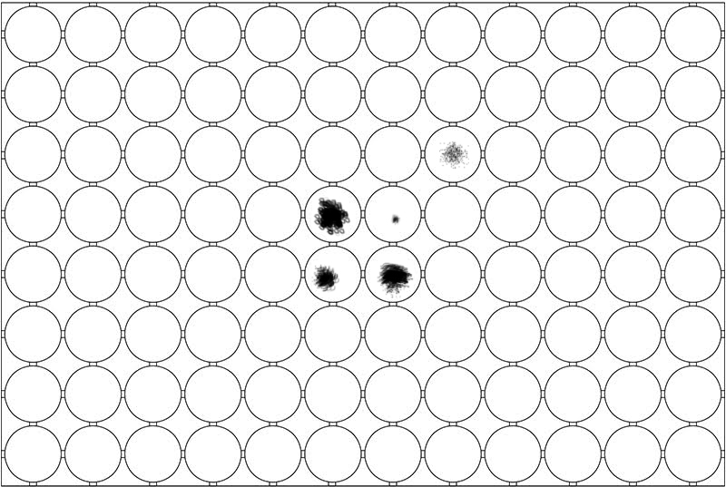
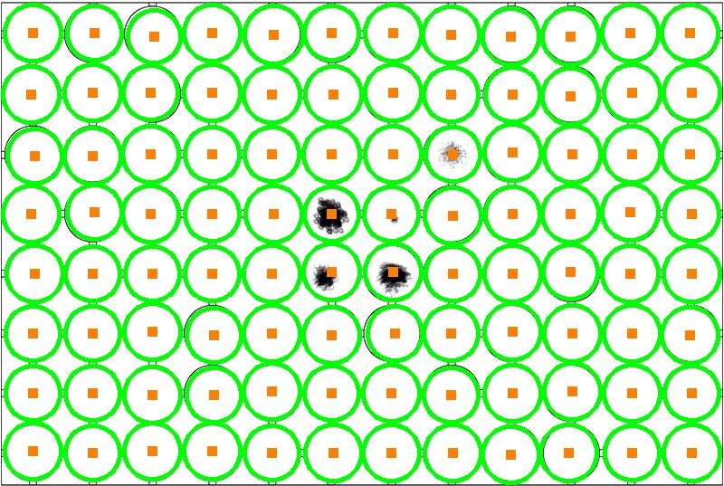
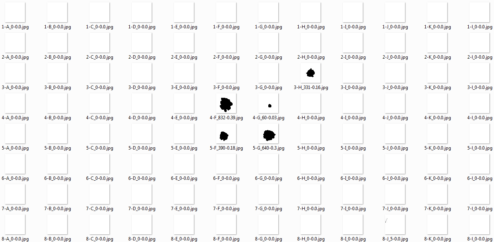
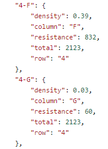

# Antibiotic Resistance Process - ARP
This software is aimed to quantify bacterial resistance to antibiotics by analysing pictures of phenotypic plates. Currently it supports 96 well plates where different bacteria are cultured with different concentrations of antibiotics. Computer vision algorithms have been implemented in order to detect different levels of bacterial growth. As a result, the software generates a report providing quantitative information for each well of the plate. Pictures should be taken so that the plate is square with the picture frame, the algorithm should be able to cope with a slight rotation of the plate.

<table>
  <colgroup>
    <col span="2" style="background-color:red">
    <col style="background-color:yellow">
  </colgroup>
  <tr>
    <th>plate</th>
    <th>segmentated wells</th>
  </tr>
  <tr>
    <td align="middle"></td>
    <td align="middle"></td>
  </tr>
    <tr>
    <th>extracted resistance</th>
    <th>report</th>
  </tr>
  <tr>
    <td align="middle"></td>
    <td align="middle"></td>
  </tr>
</table>

## Execution:
python antibiotic_resistance.py --image images/\<platename\>.png

### input:
images/\<platename\>.png with a plate and ninety six wells

### output:
* Image with extracted wells: images/\<platename\>/outputXXX.png 
* Cropped image of extracted well: images/\<platename\>/\<row\>_\<column\>_\<resistance\>_\<density\>.png
* Report in json format: images/\<platename\>/report.json
* Log: images/\<platename\>/log.txt 

Description of the schema:
* row: well row index
* column: well colmun index
* total: well area in pixels
* resistance: absolute resistance found in pixels
* density: density of the resistance found

report example:
```
   "7-J":{  
      "density":0.17,
      "column":"A",
      "resistance":122,
      "total":706,
      "row":"4"
   }
```
output images example:
```  
4-A_122-0.23, is the well 4-A, with 122 pixels found as resistance with density of 17%
```
output log example:
```
customizing scale well: found False, num wells 93, min radius value 18, max radius value 23
customizing scale well: found False, num wells 96, min radius value 18, max radius value 24
customizing grid matching: found False, num wells recognized 96
Succesfully processed plate, found 96 wells
```

## Key methods:
* Hough Circles method to detect circles in an image [doc](http://docs.opencv.org/2.4/doc/tutorials/imgproc/imgtrans/hough_circle/hough_circle.html)
* Wells segmentation using threshold feature of opencv [doc](http://docs.opencv.org/2.4/modules/imgproc/doc/miscellaneous_transformations.html#threshold) combining binary and otsu threshold
* Quality detection using a grid model by rows and columns and clustering them, robust to scale and sensible rotation.

## Installing dependencies
### pip
sudo apt-get install python-pip
### opencv
sudo apt-get install build-essential
sudo apt-get install cmake git libgtk2.0-dev pkg-config libavcodec-dev libavformat-dev libswscale-dev
sudo apt-get install python-opencv
### scilab
sudo apt-get install python-scipy

## Installation

There are two ways of installing pynteractive:

* Cloning the project

```bash
$ git clone https://github.com/mazeitor/antibiotic-resistance-process.git
$ cd antibiotic-resistance-process
$ python setup.py install  ### (as root)
```
 
* Via [Python package index](https://pypi.python.org/pypi/pip) (pip)
```bash
$ pip install arp
```

## TODO
* Adaptative to different plates size in rows and columns 
* Normalizing radius by neighborhood instead of general average
